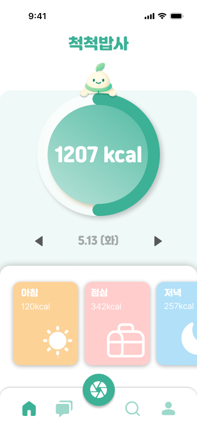
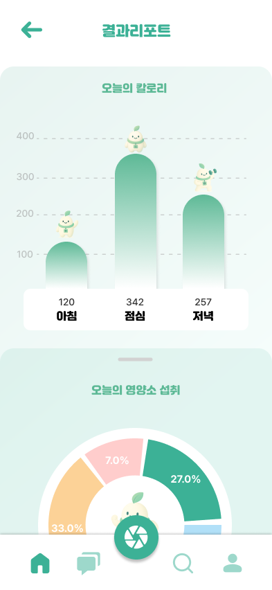
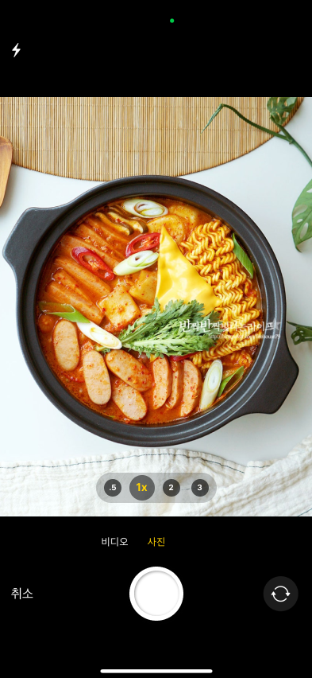
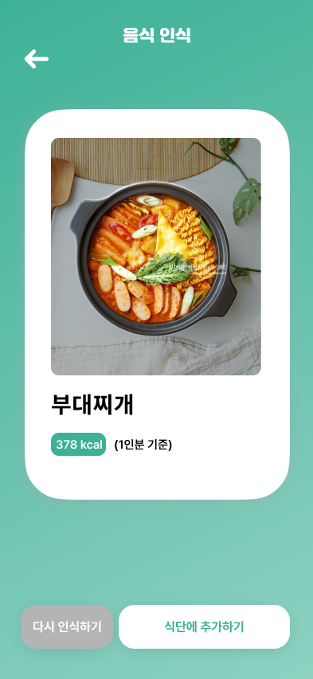
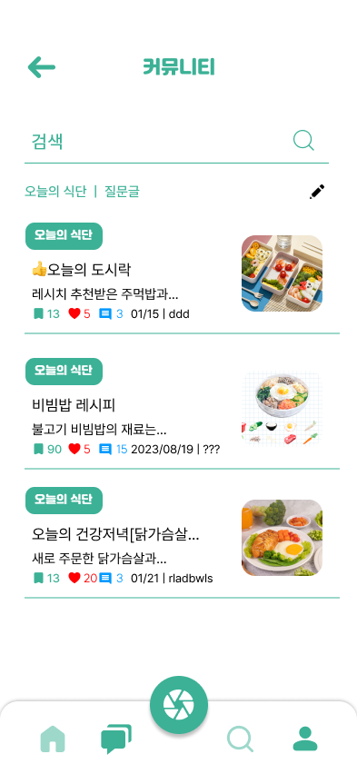
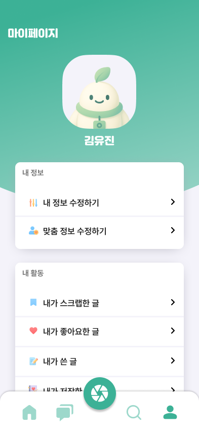
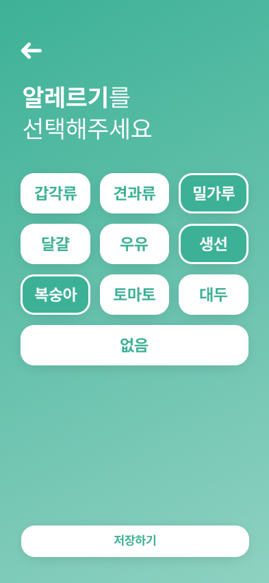
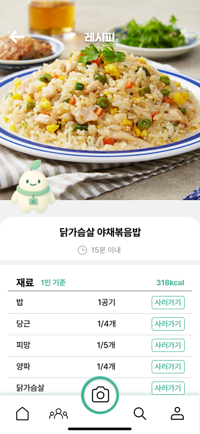
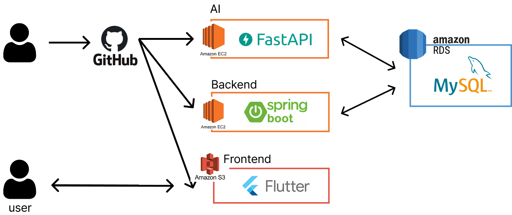

# 🥗맞춤형 건강 식단 추천 <척척밥사>

### 📚프로젝트 배경
 질병관리청 분석 및 대학 연구팀 조사 결과, 2030세대 식습관 평가 지수가 전 연령층 대비 가장 낮았습니다. 다양한 스트레스 요인 해소를 위한 자극적인 음식, 밤늦은 시간의 야식, SNS 유행 속 자극적인 음식을 따라 섭취하는 경우도 많아졌습니다.
 
 하지만 이와 동시에 “제로 슈거” 제품으로 당 섭취를 줄이려는 열풍이 불고 있으며, 배달 음식 기피 흐름이 생겨나고 있습니다. 또한, 약 100명의 대학생을 대상으로 직접 실시한 설문 조사 결과에서도 맞춤형 식단 추천의 니즈를 발견하였습니다. 
 이에 따라, 척척밥사는 2030 청년층을 초기 타겟으로 사용자의 신체 정보, 생활 습관, 알레르기, 식습관 데이터를 기반으로 맞춤형 식단과 조리법을 제공하는 건강 관리 플랫폼을 구축하고자 합니다.

 ### 💡주요 기능 및 서비스
 

  
  
  
  

  
  
  
  

 1. 맞춤형 식단 설문 및 추천
 - 사용자 정보 (신체정보, 질환, 알레르기, 선호/기피 식품 등) 입력
 - AI 기반 끼니별 맟춤 식단 추천 (주간 단위 제공)

 2. 식단 이미지 인식 및 자동 기록
- 식사 사진 업로드 -> 음식 인식 AI 활용
- 칼로리 영양소 분석 -> 식단 자동 반영
- 수기 입력 없이 간편한 식사 기록 가능

 3. 식단 분석 및 영양 리포트 시각화
- 하루 섭취한 총 열량 및 탄.단.지 비율 시각적으로 제공
- 섭취 편중 시 경고 메시지를 통해 식습관 개선 유도

 4. 레시피 제공 및 장보기 연동
- 추천 식단과 상세 레시피 함께 제공
- 필요한 재료는 장바구니 기능과 연동 -> 즉시 구매 가능

 5. 커뮤니티 기능
- 식단 구성 관련 질문 / 정보 공유
- 게시글, 댓글, 좋아요, 스크랩 기능
- 키워드 검색을 통한 정보 탐색

 6. 마이페이지 및 사용자 정보 관리
 - 회원 정보 수정 및 탈퇴
 - 작성한 글/댓글, 좋아요/스크랩, 저장한 레시피 등의 활동 내역 확인 및 관리

### 🛠️Structure

 ### ⛳️기술 소개
🍛 YOLOv5 기반 음식 인식 모델
 - 한식 포함 50종 이상 커스텀 데이터셋 (COCO format)
 - YOLOv5 기반 파인튜닝 (Epoch 100, Batch 16)
 - 음식 이미지 실시간 인식 -> 영양 정보 제공

🧠 AI 기반 개인형 식단 추천
 - 입력 정보: 알레르기, 질환, 신체정보, 선호/비선호 음식 가중치 적용
 - 위험 식품 제거 + 칼로리. 영양 기준 적용

### 기존 앱과의 차별점
| 차별 요소                  | 내용                             |
| ---------------------- | ------------------------------ |
| 🎯 **청년 타겟 전략**        | 2030세대의 식습관 문제 해결을 위한 특화 설계    |
| 🍽️ **기호/알레르기 기반 개인화** | 다이어트 식단 → **'나만을 위한 건강 식단'**   |
| 🍳 **레시피 & 조리 실현력**    | 식단과 함께 실제 조리 가능한 레시피까지 제공      |
| 🛒 **재료 구매 원스톱 시스템**   | 식단 → 레시피 → 재료 구매까지 한 번에 해결     |
| 💬 **커뮤니티 기능**         | 식단 정보 공유, 해시태그 기반 탐색, 상호 자극 유도 |

### 🌱기대효과
1. 개인화된 관리 효과 제공
2. AI 기반 실시간 학습 및 추천 고도화
3. 편리한 재료 구매 연동
4. 풍부한 사용자 경험 제공

### Members
| 🧑‍💻 이름 | 🛠 역할 |  Github |
|---------|------|-------------|
| 🐼 김예지 | 인공지능 |[@jyhannakim](https://github.com/jyhannakim)|
| 🐤 한이연 | 백엔드 |[@docherryra](https://github.com/docherryra)  |
| 🐏 양나래 | 백엔드 |[@didskfo](https://github.com/didskfo)  |
| 🐰 정현주 | 프론트엔드 | [@jhj04](https://github.com/jhj04) |
| 🐱 황연주 | 프론트엔드 |[@jooya38](https://github.com/jooya38)  |
| 🐨 지성민 | 디자이너 |  |
